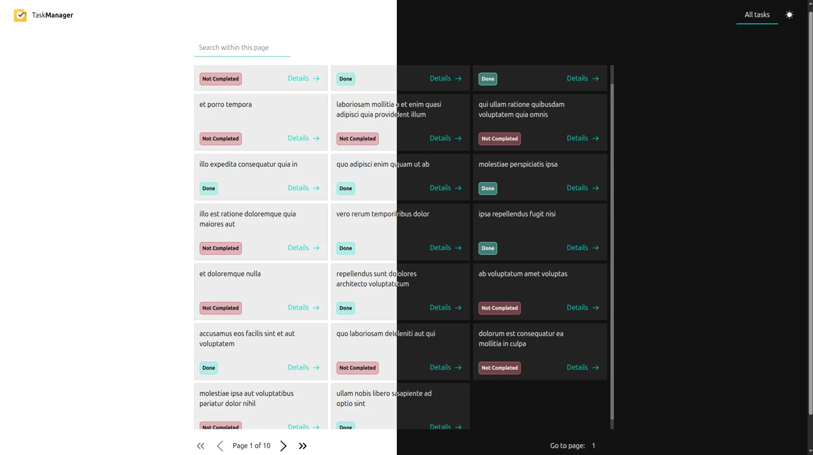

# Task Management App

A simple **Task Management Application** built with **React** that consumes data from the **JSONPlaceholder API**.  
This project demonstrates client-side routing, global state management, reusable components, and asynchronous data handling.

---

## Project Overview

The Task Management App allows users to:

- View a list of tasks fetched from an external API
- Navigate to a detailed view of a single task
- Change task status which will be saved on localstorage
- Toggle between **Light** and **Dark** themes
- Search and paginate tasks
- Handle loading states and invalid routes gracefully

This project was built as part of a **React assignment**.



---

## Tech Stack

- **React**
- **React Router**
- **Tailwind CSS**

---

## Project Folder Structure

```sh
src/
├── components/             # Reusable UI components
│ ├── Nav.jsx               # Navigation bar
│ ├── Task.jsx              # Single task UI
│ ├── TaskList.jsx          # Task list container
│ ├── Pagination.jsx        # Pagination controls
│ ├── Search.jsx            # Task search input
│ ├── Badge.jsx             # Status indicator (Done / Not completed)
│ └── Loading.jsx           # Loading spinner
│
├── pages/                  # Route-based pages
│ ├── HomePage.jsx          # Welcome / landing page
│ ├── TaskListPage.jsx      # Displays tasks list
│ ├── TaskDetailsPage.jsx   # Single task details
│ └── NotFoundPage.jsx      # 404 page
│
├── hooks/                  # Custom React hooks
│ ├── useFetch.js           # Custom data fetching hook
│ └── useDebounce.js        # Debounced text logic
│
├── context/                # Global state management
│ └── ThemeContext.jsx      # Light/Dark mode provider
│
├── assets/                 # Static assets (icons, images)
│
├── App.jsx                 # App layout and routes
├── main.jsx                # React entry point
└── index.css               # Global styles
```

## Data Fetching

Data is fetched from **JSONPlaceholder API** using a custom hook:

- Task List:  
  `https://jsonplaceholder.typicode.com/todos?_limit=20`

- Task Details:  
  `https://jsonplaceholder.typicode.com/todos/:id`

Loading states are handled using conditional rendering.

---

## Features

- Task list fetched from API
- Search tasks by title
- Change task status
- Pagination support
- Light / Dark mode toggle
- Loading indicators
- Custom 404 page
- Reusable components & hooks

---

## How to Run the Project Locally

```bash
# Clone the repository
git clone git@github.com:Rai321han/task_management.git

# Navigate to the project directory
cd task_management

# Install dependencies
npm install

# Start the development server
npm run dev
```
